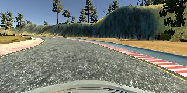
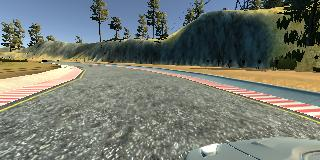
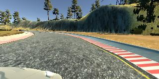
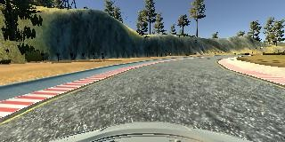
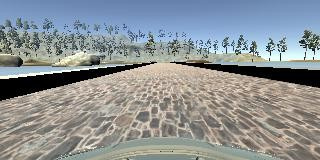

#**Behavioral Cloning** 

---

**Behavioral Cloning Project**

The goals / steps of this project are the following:
* Use the simulator to collect data of good driving behavior
* Build, a convolution neural network in Keras that predicts steering angles from images
* Train and validate the model with a training and validation set
* Test that the model successfully drives around track one without leaving the road
* Summarize the results with a written report


[//]: # (Image References)

[image1]: ./examples/placeholder.png "Model Visualization"
[image2]: ./examples/placeholder.png "Grayscaling"
[image3]: ./examples/placeholder_small.png "Recovery Image"
[image4]: ./examples/placeholder_small.png "Recovery Image"
[image5]: ./examples/placeholder_small.png "Recovery Image"
[image6]: ./examples/placeholder_small.png "Normal Image"
[image7]: ./examples/placeholder_small.png "Flipped Image"

## Rubric Points
###Here I will consider the [rubric points](https://review.udacity.com/#!/rubrics/432/view) individually and describe how I addressed each point in my implementation.  

---
###Files Submitted & Code Quality

####1. Submission includes all required files and can be used to run the simulator in autonomous mode

My project includes the following files:
* `model.py` containing the script to create and train the model
* `drive.py` for driving the car in autonomous mode, the speed is updated to 18
* `model.h5` containing a trained convolution neural network 
* `writeup_report.md` summarizing the results
* `generate_data.py` used for generating additional training data through
 autonomous driving
* a YouTube video of the autonomous driving using the model on the 
second track 

####2. Submission includes functional code
Using the Udacity provided simulator and my drive.py file, the car can be driven autonomously around the track by executing 
```sh
python drive.py model.h5
```

####3. Submission code is usable and readable

The model.py file contains the code for training and saving the convolution neural network. The file shows the pipeline I used for training and validating the model, and it contains comments to explain how the code works.

###Model Architecture and Training Strategy

####1. An appropriate model architecture has been employed

My model (defined in the function `train_model`, lines 98-139 in `model.py`) is a convolutional neural network based on the 
[Nvidia's convolutional neural network for self-driving](http://images.nvidia.com/content/tegra/automotive/images/2016/solutions/pdf/end-to-end-dl-using-px.pdf).
It consists of 5 convolutional layers followed by 4 fully-connected layers. Relu activation is applied between each layer, and we also apply
dropout between final convolutional layer and the first fully-connected layer to control overfitting.

Please refer to `model.py` for the exact dimension of each layer.

####2. Attempts to reduce overfitting in the model

As mentioned in (1.), the model contains a dropout layer between the final convolutional layer
 and the first fully-connnected layer in order to reduce overfitting (`model.py` line 132). 

The model was trained and validated on different data sets to ensure that the model was not overfitting (`model.py` lines 149-152). 
We also used checkpoints and early-stopping (`model.py` lines 144-147) to retain the highest performing models (based on validation loss) and stop
the training early if the validation loss does not improve in three epochs. 

The model was tested by running it through the simulator and ensuring that the vehicle could stay on the track.

####3. Model parameter tuning

The model used an adam optimizer, so the learning rate was not tuned manually (`model.py` line 141).

####4. Appropriate training data

Training data was chosen to keep the vehicle driving on the road. I drove the car both clockwise and 
counter-clockwise on both tracks while trying to keep the car near the center of the lane.

For additional details about how I created the training data, see the next section. 

###Model Architecture and Training Strategy

####1. Solution Design Approach

The overall strategy for deriving a model architecture was to gather a large set of "high quality" (i.e. well-driving) training data and 
modify Nvidia's convolution neural network architecture to our data dimension. I chose use Nvidia's architecture partly because it
was recommended in the course video, partly because it's fairly simple to implement and I was curious to see how well it does.

Given the dimension of the training images is 90x230x3 and not 66x200x3 as in Nvidia's architecture, I modified the filters and strides to 
account for the increased dimensions. I refer the readers to `model.py` for the detailed architecture.

In order to gauge how well the model was working, I split my image and steering angle data into a training and validation set at a 80/20 ratio
by setting the `validation_split` parameter in `model.fit` (line 148) to 0.2. 

In order to combat overfitting, I added a dropout layer with 0.5 probability of dropping a weight after the flattening (line 132, between the final
convolutional layer and the first fully-connected layer). Moreover, I enabled checkpoint and early-stopping callbacks to save the best performing
model so far (based on validation loss) and terminate the training early if the validation loss does not improve in 3 epochs (lines 144-147).

These design decision, together with the large amount of training data we generated (see (3.) below), the first model trained performed
quite well driving around track one and track two at the default speed. When I modified the speed from 9 to 20, the model continued to perform
 well on track one but consistently fell off the track on track two. To fix this, instead of modifying the model, I decided to generate more
 (and higher quality) training data by modifying `drive.py` to create training data through the autonomous mode.
 
With the additional training data, I retrained the model and it performed well on both tracks. See [this YouTube video](https://www.youtube.com/watch?v=-NvJF6Zed8Y) 
for autonomous driving on track two with the final model at 18 mph. The dashcam footage for autonomous driving on track one is available
as `video.mp4`.

At the end of the process, the vehicle is able to drive autonomously around the track without leaving the road.

####2. Final Model Architecture

The final model architecture (`model.py` lines 98-139) consisted of a convolution neural network with the following layers and layer sizes (output of `model.summary`):
<pre>
Layer (type)                     Output Shape          Param #     Connected to                     
====================================================================================================
cropping2d_1 (Cropping2D)        (None, 90, 320, 3)    0           cropping2d_input_1[0][0]         
____________________________________________________________________________________________________
lambda_1 (Lambda)                (None, 90, 320, 3)    0           cropping2d_1[0][0]               
____________________________________________________________________________________________________
convolution2d_1 (Convolution2D)  (None, 43, 158, 24)   1824        lambda_1[0][0]                   
____________________________________________________________________________________________________
convolution2d_2 (Convolution2D)  (None, 20, 77, 36)    21636       convolution2d_1[0][0]            
____________________________________________________________________________________________________
convolution2d_3 (Convolution2D)  (None, 8, 37, 48)     43248       convolution2d_2[0][0]            
____________________________________________________________________________________________________
convolution2d_4 (Convolution2D)  (None, 3, 18, 64)     27712       convolution2d_3[0][0]            
____________________________________________________________________________________________________
convolution2d_5 (Convolution2D)  (None, 1, 16, 72)     41544       convolution2d_4[0][0]            
____________________________________________________________________________________________________
flatten_1 (Flatten)              (None, 1152)          0           convolution2d_5[0][0]            
____________________________________________________________________________________________________
dropout_1 (Dropout)              (None, 1152)          0           flatten_1[0][0]                  
____________________________________________________________________________________________________
dense_1 (Dense)                  (None, 100)           115300      dropout_1[0][0]                  
____________________________________________________________________________________________________
dense_2 (Dense)                  (None, 50)            5050        dense_1[0][0]                    
____________________________________________________________________________________________________
dense_3 (Dense)                  (None, 10)            510         dense_2[0][0]                    
____________________________________________________________________________________________________
dense_4 (Dense)                  (None, 1)             11          dense_3[0][0]                    
====================================================================================================
</pre>

####3. Creation of the Training Set & Training Process

To capture good driving behavior, I first recorded two laps on track one using center lane driving. Here is an example image of center lane driving:



I used the images taken for left and right dashcams to simulate the effect of correcting back from the side to the center.




The steering angles are adjusted by +0.2 and -0.2 for these images from the actual steering angle.

I then recorded the car driving in the counter-clockwise direction in the same fashion.

Then I repeated this process on track two in order to get more data points. Moreover, I also drove in the left lane in both clockwise and
counter-wise direction to generate even more data.

To augment the data sat, I also flipped images and angles thinking that this would help to balance the number of left turns and right turns.
For example, here is an image that has then been flipped:




Finally, after training an initial model using these data, I modified `drive.py` to generate
more training data through autonomous driving. The updated code is in `generate_data.py`. I used
a speed limit of 20 to generate the new data.

I finally randomly shuffled the data set and put 20% of the data into a validation set. 

I used this training data for training the model. The validation set helped determine if the model was over or under fitting. 
The ideal number of epochs was 3 in training the final model. I used an adam optimizer so that manually training the learning rate wasn't necessary.
